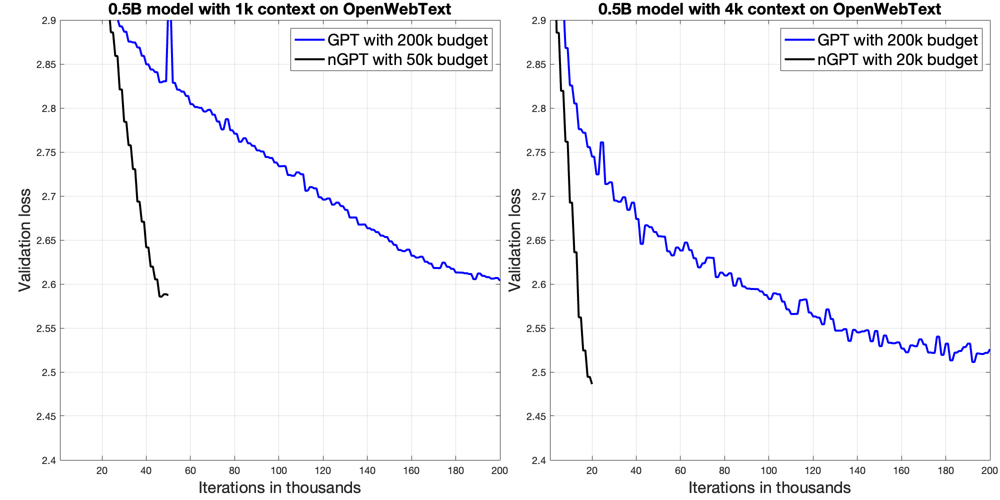
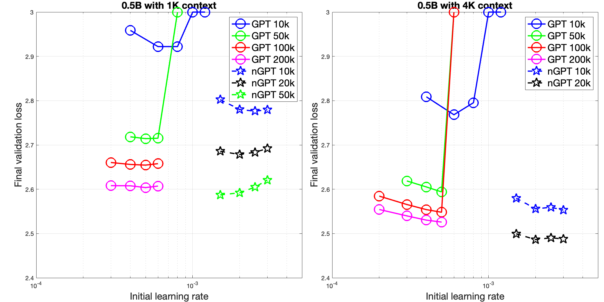

Copyright(c) 2024 NVIDIA CORPORATION & AFFILIATES. All rights reserved.
 
MIT License
[https://opensource.org/license/mit](https://opensource.org/license/mit)

Permission is hereby granted, free of charge, to any person obtaining a
copy of this software and associated documentation files (the "Software"),
to deal in the Software without restriction, including without limitation
the rights to use, copy, modify, merge, publish, distribute, sublicense,
and/or sell copies of the Software, and to permit persons to whom the
Software is furnished to do so, subject to the following conditions:

The above copyright notice and this permission notice shall be included in
all copies or substantial portions of the Software.

THE SOFTWARE IS PROVIDED "AS IS", WITHOUT WARRANTY OF ANY KIND, EXPRESS OR
IMPLIED, INCLUDING BUT NOT LIMITED TO THE WARRANTIES OF MERCHANTABILITY,
FITNESS FOR A PARTICULAR PURPOSE AND NONINFRINGEMENT. IN NO EVENT SHALL
THE AUTHORS OR COPYRIGHT HOLDERS BE LIABLE FOR ANY CLAIM, DAMAGES OR OTHER
LIABILITY, WHETHER IN AN ACTION OF CONTRACT, TORT OR OTHERWISE, ARISING
FROM, OUT OF OR IN CONNECTION WITH THE SOFTWARE OR THE USE OR OTHER
DEALINGS IN THE SOFTWARE.

Please take a moment to read this text in full. It may save you time.

# **nGPT: Normalized Transformer with Representation Learning on the Hypersphere**

**Authors**: Ilya Loshchilov, Cheng-Ping Hsieh, Simeng Sun, and Boris Ginsburg  
**Paper**: [arXiv:2410.01131](https://arxiv.org/abs/2410.01131)

---

This repository provides code for **nGPT**, which builds on **nanoGPT** by Andrej Karpathy. Familiarity with nanoGPT's codebase is **required**, as it resolves common issues relevant here. With this foundation, you’ll find using and understanding nGPT much easier.

## **Project Overview**

The main difference in this codebase lies in the Transformer models:

1. **Modifications**: 
   - `model.py` includes both the **original** and **normalized Transformer** models.
   - `train.py` contains the **normalization procedure** for training.
   - The architecture follows the paper's specifications, except for vocabulary size.

2. **Dependencies**:
   - **nanoGPT**: To generate the data folder with OpenWebText, see the [nanoGPT repository](https://github.com/karpathy/nanoGPT).
   - **FlashAttention**: FlashAttention from [Dao-AILab](https://github.com/Dao-AILab/flash-attention) (BSD 3-Clause License) is used, though PyTorch’s default attention can be substituted if preferred.

## **Getting Started**

### **Running the Code**

To start the training process with defined hyperparameters, execute `launcher.sh`.

### **Experiment Replication**

This code reproduces the experiments from our paper which were conducted using NVIDIA's internal libraries. Specifically, we reproduce the reported speedups:
- **4x** speedup for a sequence length of 1k
- **10x** speedup for a sequence length of 4k

Here, we tested only the 0.5B model, as the paper suggests that the speedup numbers for the 0.5B and 1B models are very similar. The speedup factor also depends on the training budget: the longer the run, the greater the speedup, meaning the reported numbers can be exceeded.

---

---

### **Notable Differences and Observations**

- **Learning Rate**: The baseline GPT in nanoGPT diverges at higher learning rates, unlike our internal code. Thus, optimal learning rates differ slightly.
- **Hyperparameter Tuning**: Below is a summary of final validation loss values across hyperparameter settings (tested on 64 GPUs in parallel). Results may vary based on the GPU.

---

---

### **Repository Goals**

Like nanoGPT, it might be beneficial to keep this code stable (with fixing only bugs) so that it can serve as a consistent reference implementation. 

This implementation is not optimized for memory or compute performance: the main goal is to **_illustrate_** how nGPT works, not to achieve a production-ready code. The paper suggests that nGPT can be simplified in various ways, sometimes without any loss in performance.

**Special Thanks**: Many thanks to Andrej Karpathy for creating the nanoGPT library, which serves as a foundational component of this project.

---

